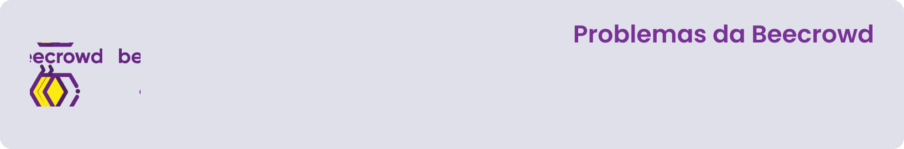

---

Repositório para o compartilhamento dos códigos submetidos à plataforma [Beecrowd](https://www.beecrowd.com.br/judge/pt). Apenas soluções aceitas pela plataforma, codificadas e comentadas por mim, a fim de facilitar a compreensão de cada código.

## 🗂 Categorias
Os problemas da Beecrowd são divididos em 9 categorias, abaixo, você poderá acessar cada uma das categorias de acordo com o progresso e desenvolvimento das minhas atividades.

---

[Iniciante](./1-iniciante/)

---

## 📥 Como baixar e executar
Para baixar os arquivos deste repositório, você deve ter o [GitHub](https://github.com/) instalado em seu dispositivo.

Após instalado, você deverá acessar a guia `Arquivo` → `Clonar repositório` → `URL` e incluir o caminho `guedesert/beecrowd`.

Além disso, é interessante que você tenha um bom editor para trabalhar com os códigos. Recomendo o uso do [Visual Studio Code](https://code.visualstudio.com/).

## 📃 Licença
Este repositório está licensiado sob a [Licença MIT](./LICENSE). Copyright © 2022-2023 Emanuel Guedes.

---

Criado com 💜 por [**Emanuel Guedes**](https://github.com/guedesert)

